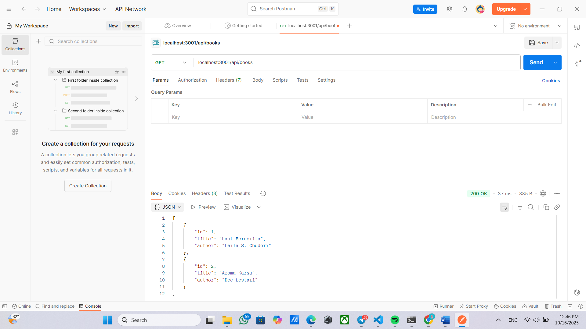
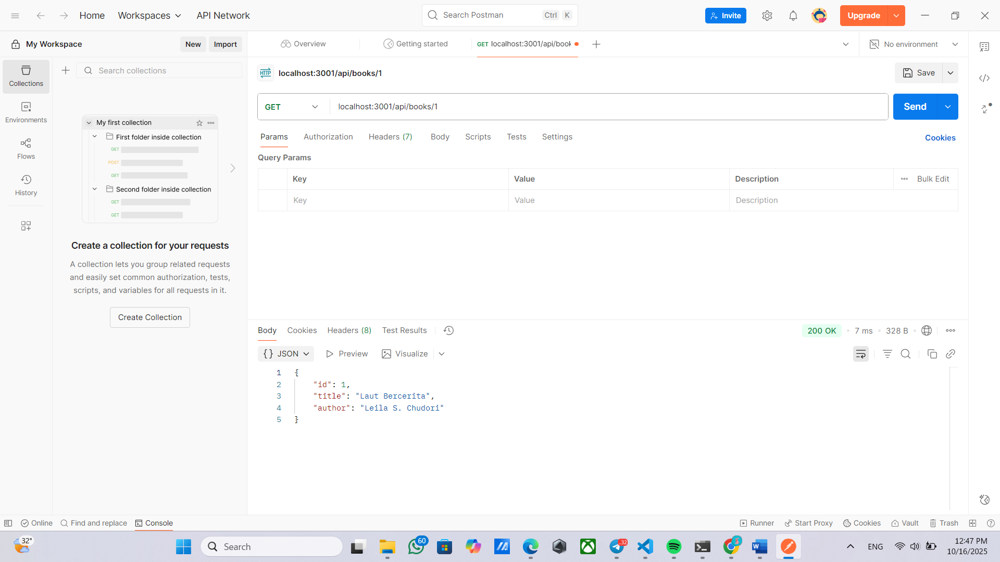
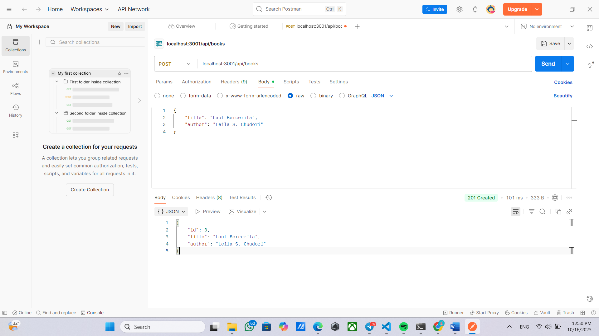
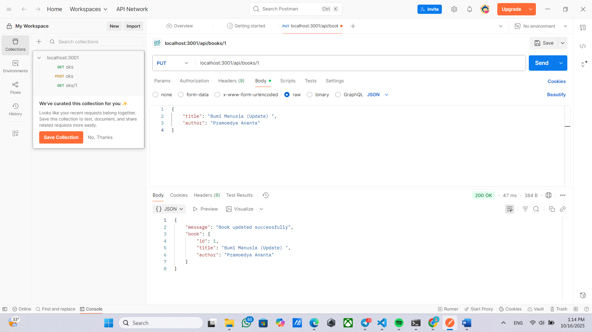
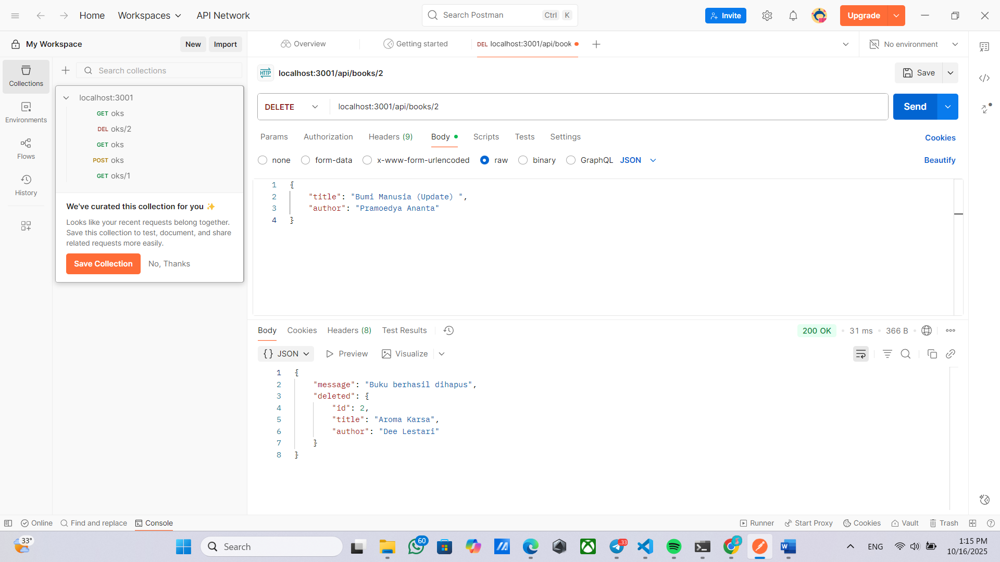

# Tugas 2

1. Tampilan Endpoint Create Book (GET ALL)

2. Tampilan Endpoint Create Book (GET BY ID)

3. Tampilan Endpoint Create Book (POST)

4. Tampilan Endpoint Create Book (PUT)

5. Tampilan Endpoint Create Book (DELETE)
