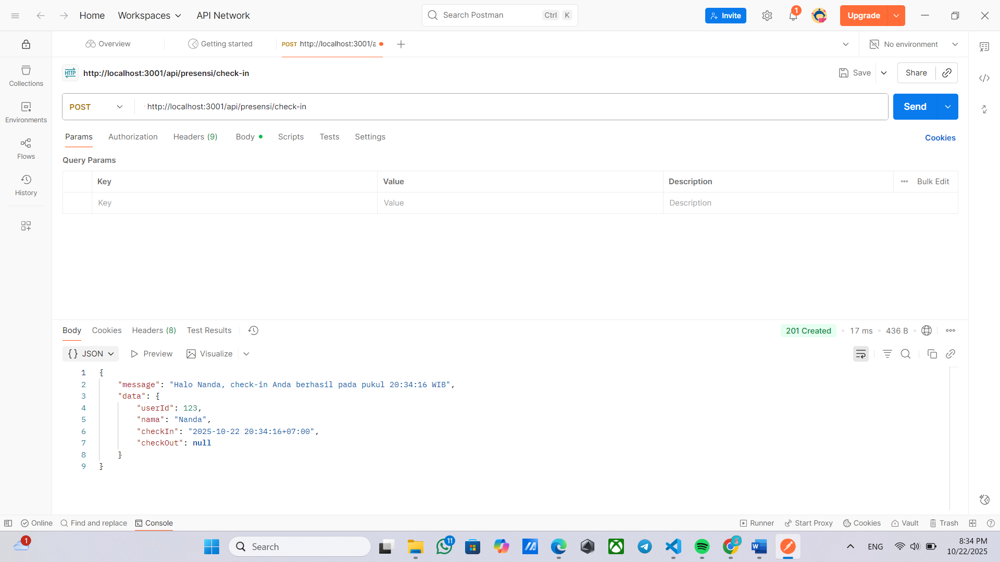
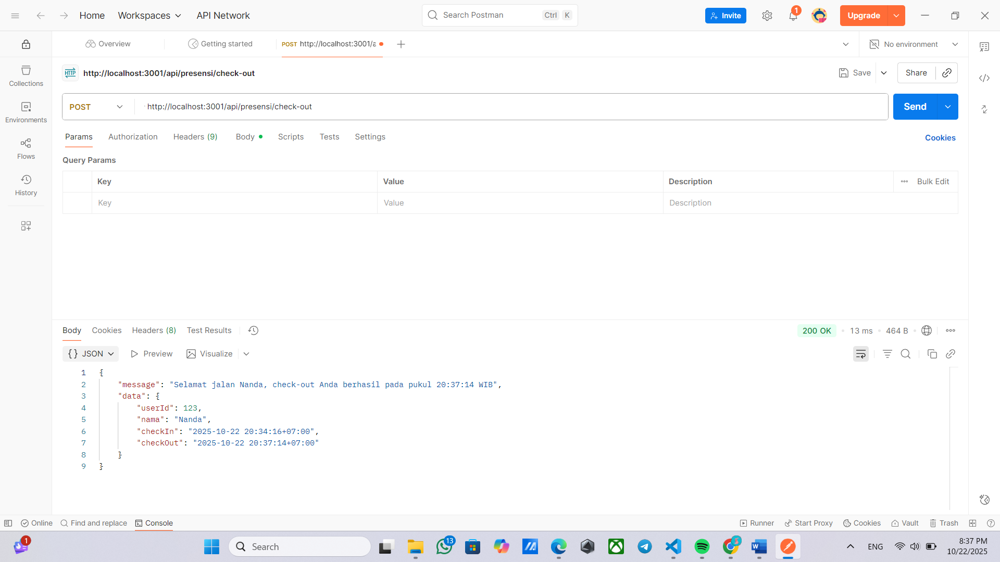
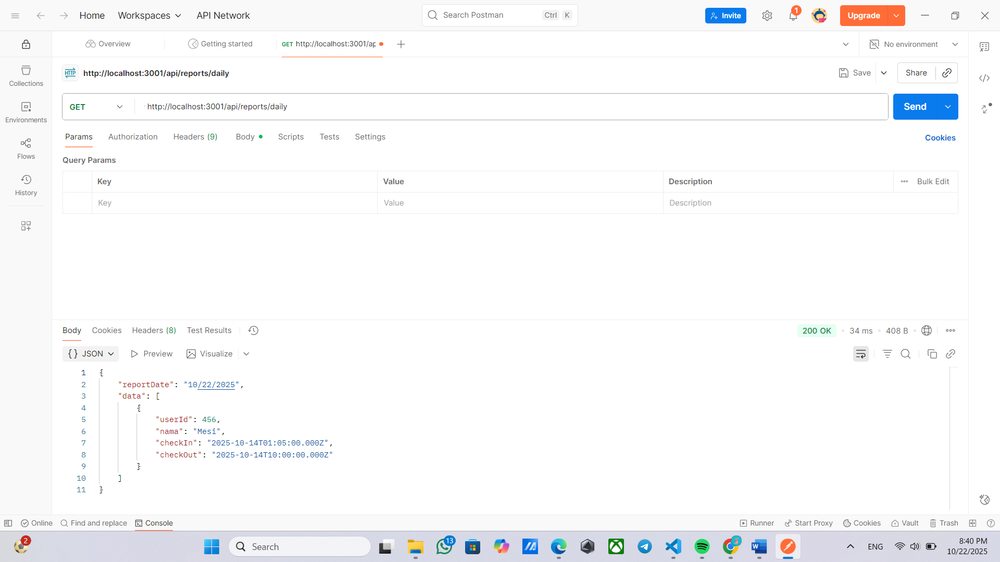

# Tugas 3

1. Tampilan Endpoint Create Book (CHECK-IN 1)

2. Tampilan Endpoint Create Book (CHECK-IN lebih dari 1 kali)

3. Tampilan Endpoint Create Book (CHECK-OUT 1)

4. Tampilan Endpoint Create Book (CHECK-OUT jika belum check-in)

5. Tampilan Endpoint Create Book (REPORTS DAILY)
